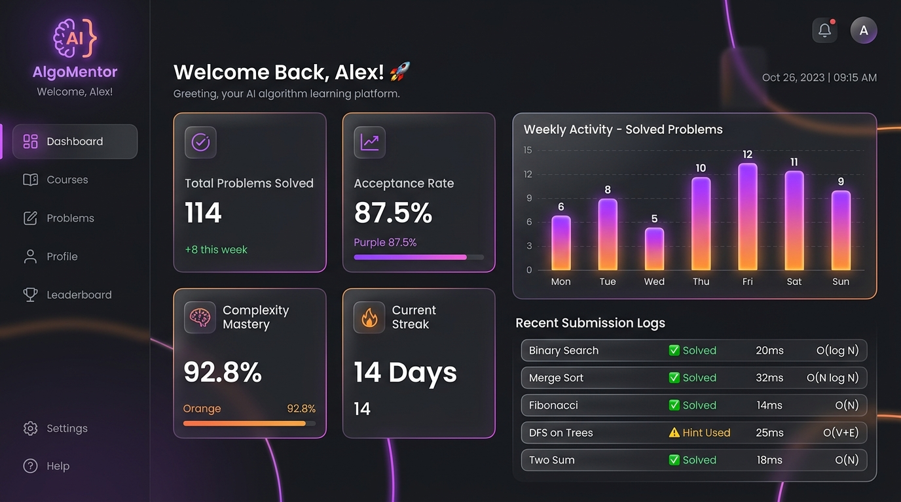
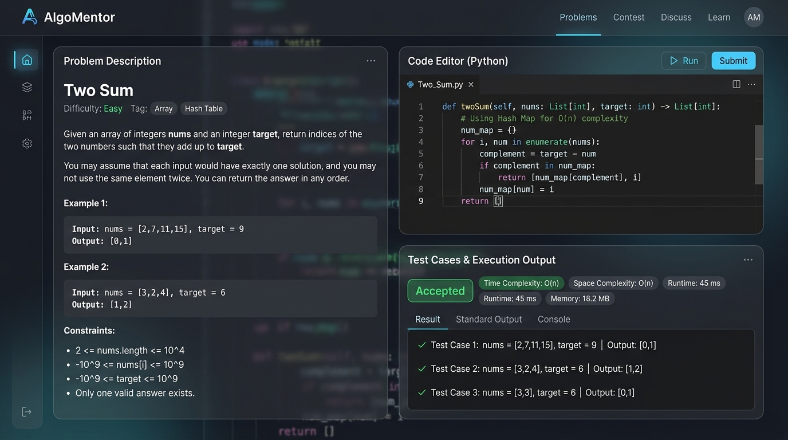
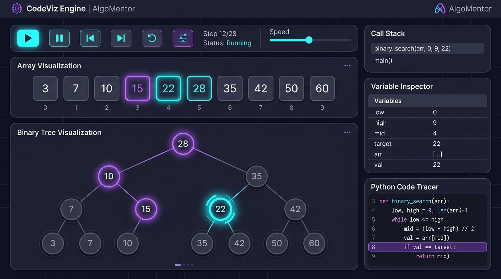
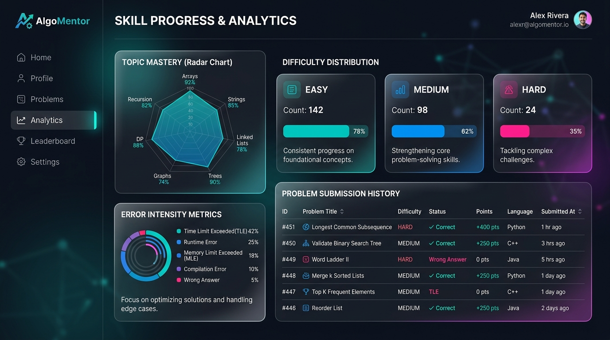
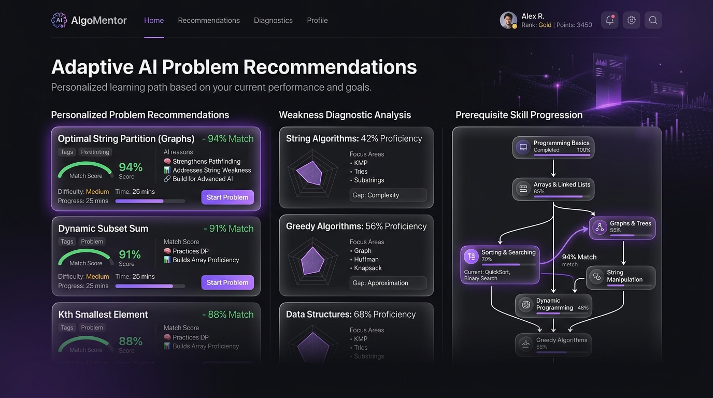

# AlgoMentor - Interactive Algorithm Learning & Visual Execution Platform

[](https://harilight.github.io/Algomentor/)

> 🚀 **Live Demo:** Explore the fully interactive frontend application directly at [https://harilight.github.io/Algomentor/](https://harilight.github.io/Algomentor/)

---

## 🌟 Feature Overview & Previews

### 1. User Dashboard & Performance KPIs
Provides real-time stats on solved problem breakdown, overall acceptance rate, time-complexity mastery, and weekly practice activity.



---

### 2. Interactive Workspace & Multi-Language IDE
Built with Monaco Editor (VS Code engine). Features real-time test case execution, verdict evaluation (Accepted, Wrong Answer, TLE), and Big-O Time & Space complexity analysis.



---

### 3. Live AST Execution Visualizer (CodeViz Engine)
Step-by-step line-by-line visual execution tracing using Python `sys.settrace` and AST inspection with dynamic call stack and variable state inspection.



---

### 4. Progress Analytics & Skill Mastery
Detailed performance diagnostics, topic distribution (Arrays, DP, Trees, Graphs), difficulty distribution breakdown, and submission history log.



---

### 5. Adaptive AI Problem Recommendations
Personalized problem recommendations based on topic mastery, error intensity, and prerequisite DAG learning paths.



---

## 🛠️ Technology Stack

- **Frontend:** HTML5, CSS3 (Vanilla Glassmorphism UI), JavaScript (ES6+), Monaco Editor, FontAwesome.
- **Backend:** Node.js, Express.js, MySQL (mysql2 pool).
- **Execution & Tracing Engine:** Python 3 (sys.settrace & AST-transformer), Node.js Code Execution Pipeline.

---

## 🚀 Getting Started

### Prerequisites
- [Node.js](https://nodejs.org/) (v16 or higher)
- [Python 3.8+](https://www.python.org/)
- [MySQL Server](https://www.mysql.com/)

### 1. Database Setup
1. Start your MySQL server.
2. Create the database `algomentor`:
   ```sql
   CREATE DATABASE algomentor;
   ```
3. Run the automated database initialization script:
   ```bash
   cd backend
   node db_setup.js
   ```

### 2. Backend Setup
1. Navigate to the backend directory:
   ```bash
   cd backend
   ```
2. Install dependencies:
   ```bash
   npm install
   ```
3. Create a `.env` file in the `backend` folder based on `.env.example`:
   ```env
   PORT=5000
   DB_HOST=localhost
   DB_USER=root
   DB_PASSWORD=your_mysql_password
   DB_NAME=algomentor
   ```
4. Start the backend server:
   ```bash
   node server.js
   ```
   The server runs on `http://localhost:5000`.

### 3. Frontend Setup
Simply open `frontend/index.html` or `frontend/login.html` in any modern web browser or visit the deployed GitHub Pages at [https://harilight.github.io/Algomentor/](https://harilight.github.io/Algomentor/).

---

## 📁 Repository Structure

```
Algomentor/
├── assets/                 # High-resolution feature previews
├── backend/
│   ├── config/             # DB connection pool setup
│   ├── routes/             # API routes (auth, execution, analytics, problems)
│   ├── codeEngine/         # Static AST complexity analysis
│   ├── visualizationEngine/# Trace data formatting
│   ├── recommendationEngine/# Skill tracking and adaptive recommendations
│   ├── trace_engine.py     # Python live AST tracer script
│   ├── server.js           # Main Express server entry point
│   ├── db_setup.js         # Self-healing MySQL table schema and seeder
│   └── package.json
├── frontend/
│   ├── assets/             # Frontend static assets
│   ├── index.html          # Landing page
│   ├── login.html & register.html
│   ├── dashboard.html      # Main user dashboard
│   ├── problems.html       # Problem directory & filtering
│   ├── workspace.html      # Problem solver & IDE interface
│   ├── visualizer.html     # Dedicated execution visualization page
│   ├── profile.html        # User settings & avatar management
│   ├── progress.html       # Progress & skill mastery analytics
│   ├── recommendations.html# Recommended practice problems
│   ├── main.js             # Global authentication and UI script
│   └── style.css           # Modern design system
└── README.md
```

---

## 📄 License
MIT License
